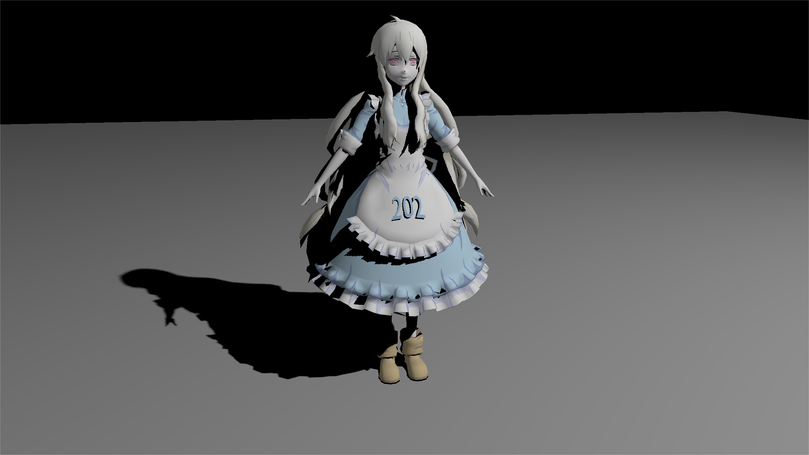
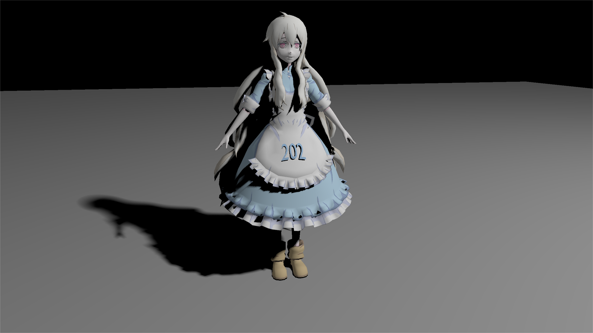
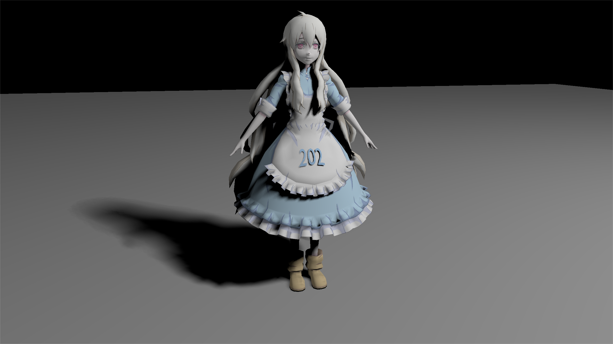
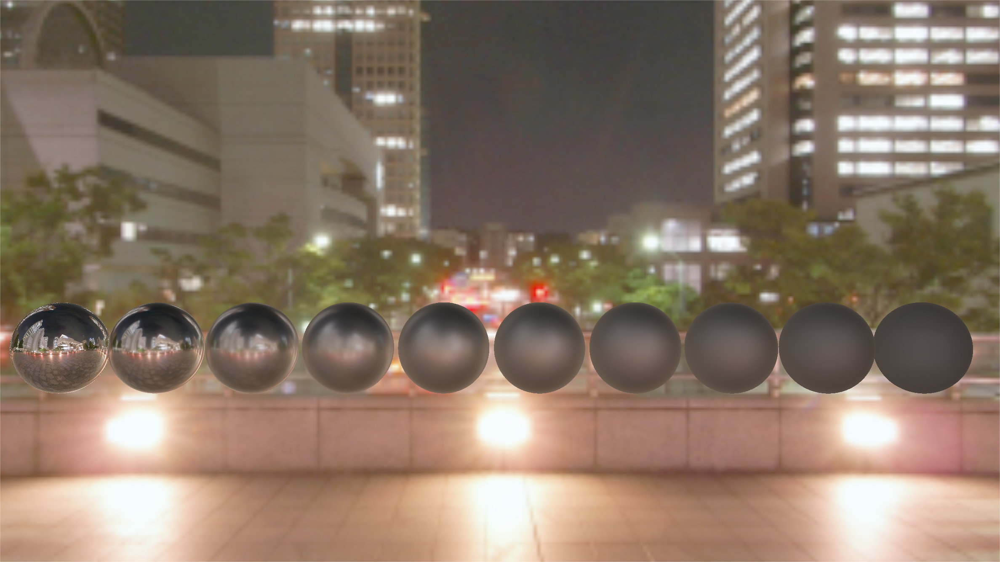

# Alkaid: Vulkan Renderer

## Introduction

Implementation of 3D rendering techniques using Vulkan C++ bindings.

## Showcase

### PCSS

Percentage closer soft shadows under different light radii.

### IBL

Image-based lighting, combined with PBR material

### And more...

## Reference

Great resources that the author refers to when building this repo:

[Vulkan Tutorial](https://vulkan-tutorial.com/)
[Sascha Willems' Vulkan Examples](https://github.com/SaschaWillems/Vulkan)